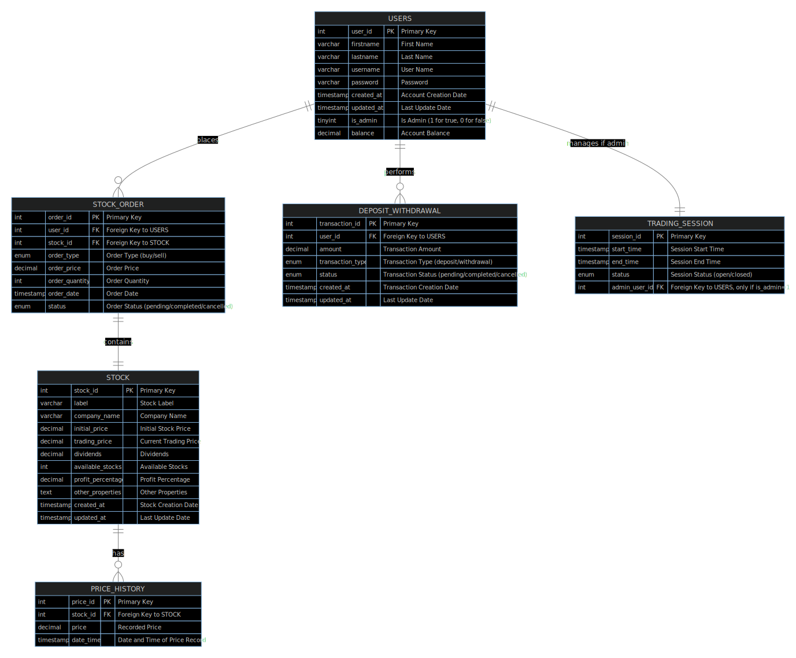

# Stock Management System

---

## Overview

The Stock Management System (Stocky) is a robust Java-based application designed to streamline stock trading, transaction management, and user account operations. It provides users with a comprehensive platform to monitor investments, execute trades, and analyze stock market data effectively.

---

## Features

Stocky offers the following key features:

- **User Authentication**: Secure login system for accessing the application.
- **Account Management**: Create, update, and delete user accounts.
- **Stock Trading**: Buy and sell stocks with real-time market data.
- **Transaction History**: Access detailed records of all transactions.
- **Stock Market Information**: Analyze stock performance, dividends, and company details.
- **Graphical User Interface (GUI)**: Intuitive interface built with JavaFX for easy navigation.

---

## Architecture

The system follows a modular architecture, separating concerns into different layers:

- **Presentation Layer**: Manages user interaction through a JavaFX-based graphical user interface.
- **Business Logic Layer**: Contains core business logic, including user authentication, stock trading, and transaction management.
- **Data Access Layer**: Interacts with the underlying MySQL database to perform CRUD operations on user accounts, stocks, transactions, and more.

---

## Design Documentation

### Sequence Diagram

The following sequence diagram visualizes the process flow of the application:

  

### Database Design

The database design for the Stock Management System is represented using an Entity-Relationship (ER) diagram. Below is a simplified ER diagram illustrating the relationships between various entities:

  

---

## Installation

To install and run the Stock Management System, follow these steps:

1. Clone the repository to your local machine.
2. Open the project in your preferred Java Integrated Development Environment (IDE).
3. Configure project dependencies, ensuring JavaFX and MySQL connectors are set up.
4. Set up the MySQL database by importing the provided schema and sample data (You can find the schema in the MySQL folder).
5. Run the application from your IDE.

---

## Usage

Once the application is running, follow these steps to use the Stock Management System:

1. Log in using your credentials or create a new account if you're a new user.
2. Explore available features such as stock trading, transaction history, and stock market information.
3. Perform buy or sell transactions based on your investment decisions.
4. Monitor transaction history and account balance to track your investments.

---

## Conclusion

The Stock Management System empowers users to efficiently manage investments and trade stocks. Its user-friendly interface, rich features, and adherence to industry standards ensure a seamless experience, enabling users to monitor portfolios and make informed investment decisions effortlessly.
